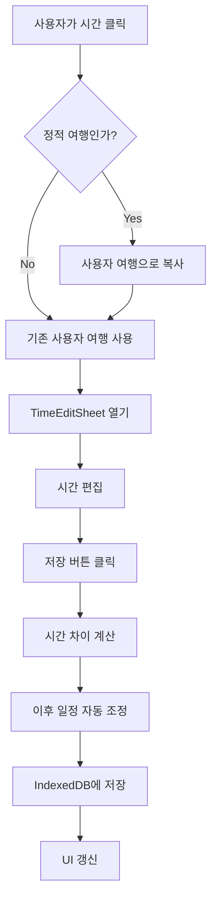

# 시간 편집 기능 구현 계획

## 개요

여행 일정의 `startTime`과 `endTime`을 편집할 수 있는 기능을 구현합니다. `endTime` 변경 시 이후 일정이 자동으로 조정되며, 편집된 데이터는 IndexedDB에 저장됩니다.

## 주요 구현 사항

### 1. 시간 편집 시트 컴포넌트 생성

- **파일**: `components/TimeEditSheet.vue`
- 하단에서 올라오는 시트 형태의 UI
- `startTime`과 `endTime`을 시간 선택기로 편집
- 저장/취소 버튼 제공
- Apple 스타일의 미니멀한 디자인

### 2. 시간 업데이트 및 일정 조정 로직

- **파일**: `composables/useTimeEditor.ts`
- 시간 문자열("HH:mm")을 분 단위로 변환/계산하는 유틸리티 함수
- `endTime` 변경 시 이후 일정 자동 조정 로직:
- 변경된 `endTime`과 기존 `endTime`의 차이 계산
- 같은 일정 내 이후 아이템들의 시간을 차이만큼 밀어내기
- 다음 일정의 첫 번째 아이템도 조정
- `startTime` 변경 시:
- 해당 아이템의 `endTime`이 `startTime`보다 이전이면 자동 조정
- 이전 아이템과의 시간 충돌 검증

### 3. 정적 여행 데이터 복사 로직

- **파일**: `composables/useTripData.ts` 또는 `stores/trip.ts`에 메서드 추가
- 정적 여행을 수정하려고 할 때 자동으로 사용자 여행으로 복사
- 복사 시 `id`는 `{원본-id}-user-{timestamp}` 형식으로 생성
- `createdAt`, `updatedAt` 필드 설정

### 4. IndexedDB 저장 로직

- **파일**: `stores/trip.ts`에 `updateItineraryItem` 메서드 추가
- 편집된 일정 데이터를 IndexedDB에 저장
- `updatedAt` 필드 업데이트
- 저장 후 `useItinerary`의 `refresh` 호출하여 UI 갱신

### 5. schedule.vue에 편집 기능 통합

- **파일**: `pages/schedule.vue`
- 시간 표시 영역에 편집 가능 표시 (아이콘 또는 터치 영역)
- 시간 클릭 시 `TimeEditSheet` 열기
- 편집 완료 후 자동 저장 및 UI 갱신

## 데이터 흐름




## 구현 세부사항

### 시간 조정 알고리즘

1. `endTime` 변경 시:

- 변경 전후의 시간 차이(분) 계산: `diff = newEndTime - oldEndTime`
- 같은 일정 내 이후 모든 아이템에 `diff` 적용
- 다음 일정의 첫 번째 아이템에도 `diff` 적용
- 날짜 경계를 넘어가는 경우 다음 날의 첫 아이템 시간 조정

2. `startTime` 변경 시:

- 해당 아이템의 `endTime`이 `startTime`보다 이전이면 `endTime = startTime + 1시간`으로 자동 설정
- 이전 아이템의 `endTime`과 겹치지 않도록 검증

### 에러 처리

- 시간 형식 검증 ("HH:mm" 형식)
- `startTime` > `endTime` 방지
- 이전 아이템과의 시간 충돌 방지
- IndexedDB 저장 실패 시 에러 메시지 표시

## 파일 구조

```javascript
components/
  └── TimeEditSheet.vue          # 시간 편집 시트 컴포넌트
composables/
  └── useTimeEditor.ts            # 시간 편집 및 조정 로직
stores/
  └── trip.ts                     # updateItineraryItem 메서드 추가
pages/
  └── schedule.vue                # 편집 기능 통합
```


## 테스트 시나리오

1. 정적 여행의 시간 편집 → 사용자 여행으로 자동 복사 확인
2. `endTime` 변경 → 이후 일정 자동 조정 확인
3. `startTime` 변경 → `endTime` 자동 조정 확인
4. 날짜 경계를 넘어가는 시간 조정 확인