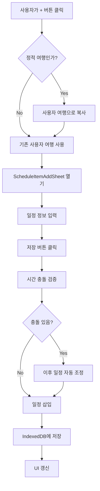

# 일정 추가 기능 구현 계획

## 개요
여행 일정에 새로운 일정 아이템을 추가할 수 있는 기능을 구현합니다. 기존 일정 사이에 삽입 가능하며, 시간 충돌 시 자동으로 시간을 조정하여 추가됩니다.

## 주요 구현 사항

### 1. 일정 추가 시트 컴포넌트 생성
- **파일**: `components/ScheduleItemAddSheet.vue`
- 하단에서 올라오는 시트 형태의 UI
- 입력 필드:
  - 제목 (필수)
  - 시작 시간 (필수)
  - 종료 시간 (필수)
  - 타입 (필수): meeting, transport, attraction, meal, free, transfer, activity, arrival
  - 위치 (선택)
  - 메모 (선택)
  - 장소 연결 (선택)
- Apple 스타일의 미니멀한 디자인
- 유효성 검증 (시간 형식, 시작 < 종료 등)

### 2. 일정 삽입 위치 선택 UI
- **파일**: `pages/schedule.vue`에 통합
- 일정 리스트의 각 아이템 사이에 "+" 버튼 또는 빈 공간 표시
- 클릭 시 해당 위치에 일정 추가 시트 열기
- 일정 리스트 맨 끝에도 추가 버튼 제공

### 3. 일정 추가 및 시간 조정 로직
- **파일**: `composables/useTimeEditor.ts`에 함수 추가
- `insertScheduleItem` 함수 구현:
  - 삽입 위치 결정 (특정 아이템 뒤 또는 맨 끝)
  - 시간 충돌 검증
  - 충돌 시 이후 일정 자동 조정
  - 새 아이템 ID 생성 (`{dayId}-item-{timestamp}`)
- 시간 충돌 처리:
  - 새 일정의 시간이 기존 일정과 겹치면 이후 일정들을 자동으로 밀어내기
  - 최소 간격 유지 (기본 15분)

### 4. IndexedDB 저장 로직
- **파일**: `stores/trip.ts`에 `addScheduleItem` 메서드 추가
- 정적 여행인 경우 사용자 여행으로 자동 복사
- 새 일정을 `itinerary.schedules[dayNumber].items` 배열에 삽입
- IndexedDB에 저장
- `updatedAt` 필드 업데이트

### 5. schedule.vue에 추가 기능 통합
- **파일**: `pages/schedule.vue`
- 일정 리스트에 삽입 버튼 추가
- 일정 추가 시트 열기/닫기 로직
- 추가 완료 후 자동 저장 및 UI 갱신

## 데이터 흐름



## 구현 세부사항

### 일정 삽입 알고리즘
1. 삽입 위치 결정:
   - 특정 아이템 뒤: `insertAfterItemId` 제공 시 해당 아이템 뒤에 삽입
   - 맨 끝: `insertAfterItemId` 없으면 `items` 배열 끝에 추가

2. 시간 충돌 처리:
   - 새 일정의 `startTime`이 이전 아이템의 `endTime`보다 이전이면:
     - 이전 아이템의 `endTime`을 새 일정의 `startTime`으로 조정
   - 새 일정의 `endTime`이 다음 아이템의 `startTime`보다 이후이면:
     - 다음 아이템부터 모든 이후 아이템을 차이만큼 밀어내기

3. ID 생성:
   - 형식: `{dayId}-item-{timestamp}`
   - 예: `d1-item-1734567890123`

### 에러 처리
- 필수 필드 검증 (제목, 시간, 타입)
- 시간 형식 검증 ("HH:mm" 형식)
- `startTime` > `endTime` 방지
- IndexedDB 저장 실패 시 에러 메시지 표시

## 파일 구조

```
components/
  └── ScheduleItemAddSheet.vue    # 일정 추가 시트 컴포넌트
composables/
  └── useTimeEditor.ts             # insertScheduleItem 함수 추가
stores/
  └── trip.ts                      # addScheduleItem 메서드 추가
pages/
  └── schedule.vue                  # 일정 추가 기능 통합
```

## 테스트 시나리오
1. 일정 리스트 끝에 일정 추가 → 정상 추가 확인
2. 일정 사이에 일정 삽입 → 정상 삽입 확인
3. 시간 충돌 시나리오 → 이후 일정 자동 조정 확인
4. 정적 여행에 일정 추가 → 사용자 여행으로 자동 복사 확인
5. IndexedDB 저장 및 UI 갱신 확인